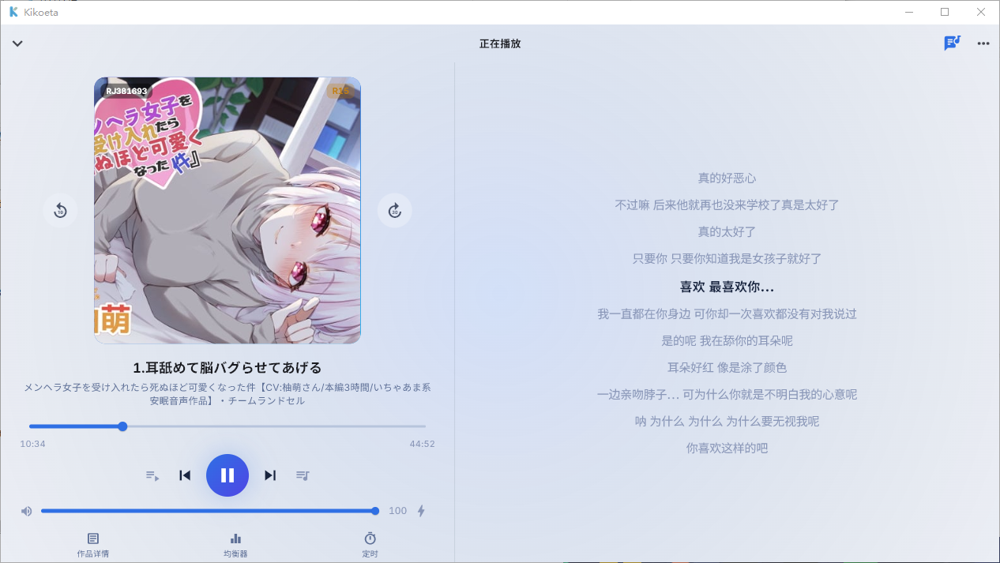
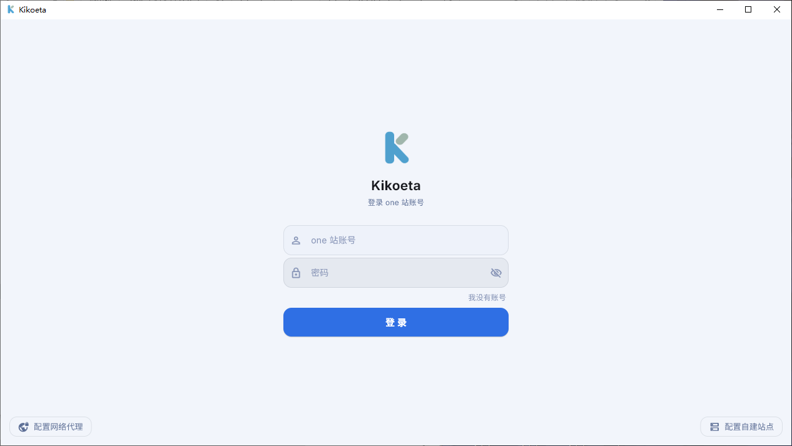
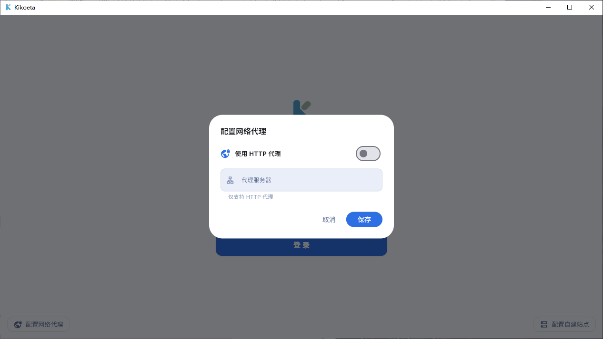
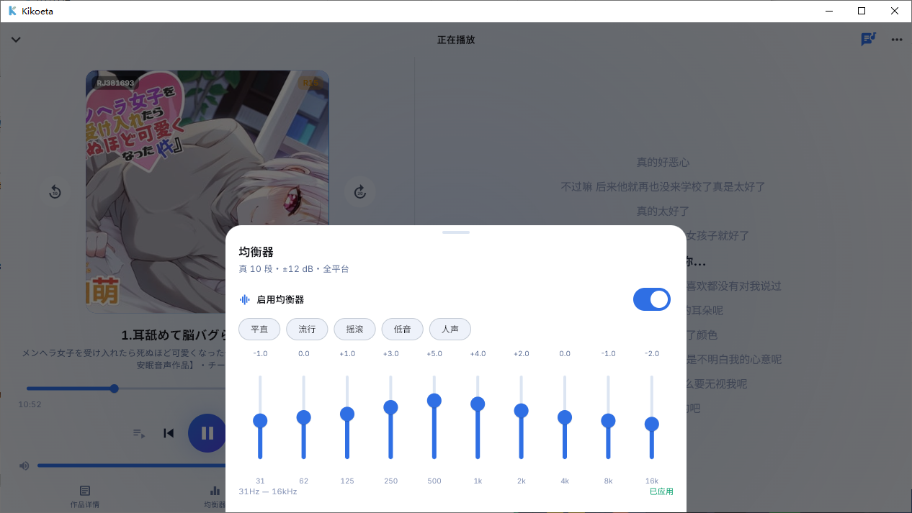
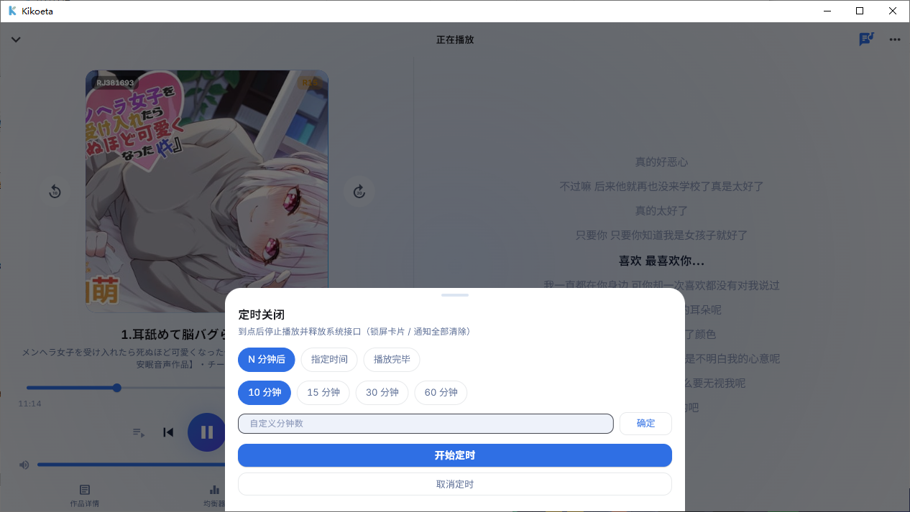
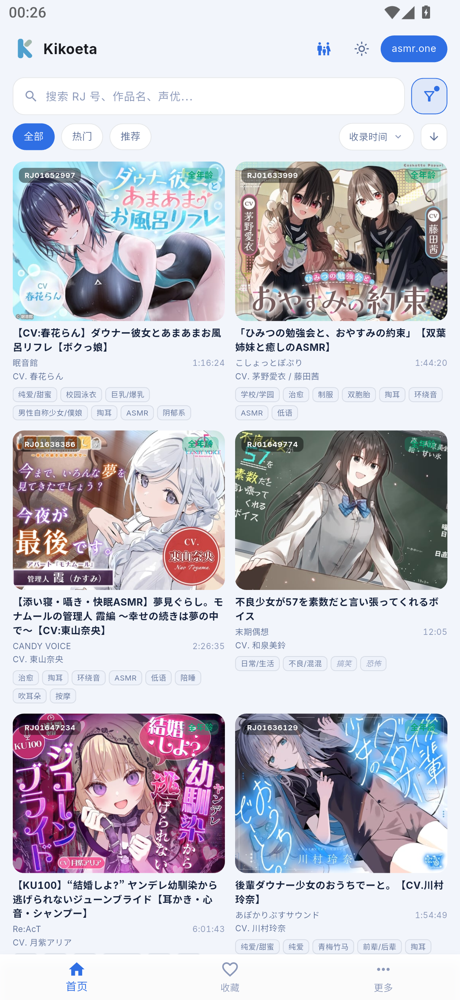
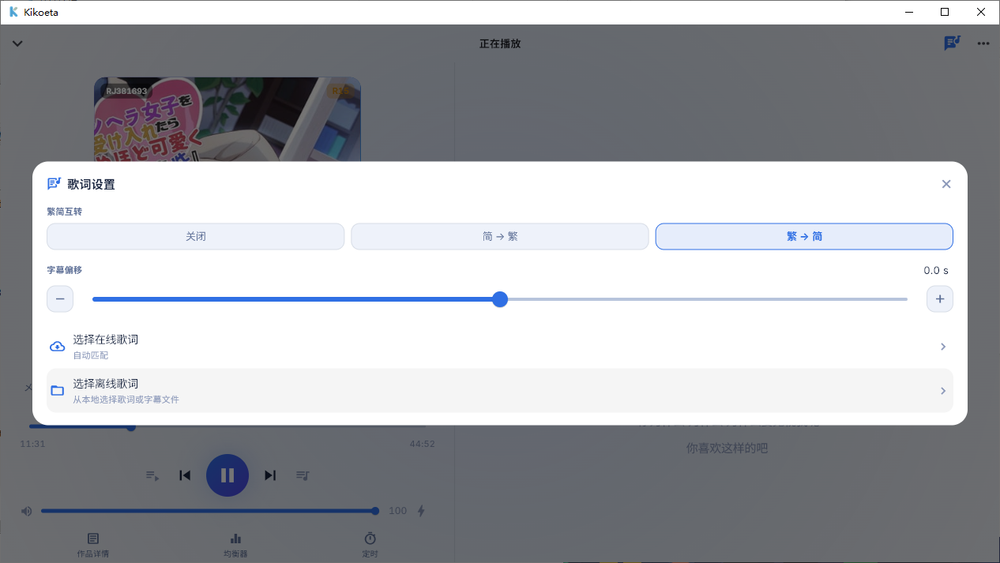

# Kikoeta

> 面向 ASMR 音声的本地收听客户端。支持 asmr.one 与基于 kikoeru-express 的自建站点，在 Windows 和 Android 上提供浏览、播放、歌词与本地资料管理体验。

[](https://github.com/chenflxs/kikoeta/releases) [](LICENSE) [](https://flutter.dev/) [](https://www.rust-lang.org/)

> [!WARNING]
> 本项目为非官方个人项目，仅供学习与本地收听使用。服务端接口及其可用性可能随时变动，请遵守相关服务的使用规则。

## 界面预览

### 桌面端




| 网络与账号 | 播放工具 |
| :---: | :---: |
| <br>账号登录与自建站点 | <br>HTTP 网络代理 |
| <br>10 段均衡器 | <br>定时关闭 |

### Android

<p align="center">
  
  
  
</p>

<p align="center">
  
  
</p>

## 功能

### 找到想听的作品

- 分页作品流与搜索：支持标题、标签、社团、声优搜索，以及热门、推荐、排序、年龄分级和字幕筛选。
- 更干净的浏览：支持 SFW 模式、黑名单过滤和搜索历史；复制 RJ 号后可直接发起搜索。
- 多服务端：可在 asmr.one 与自建 kikoeru-express 站点间切换；支持账号登录和 HTTP 代理。

### 围绕聆听设计

- 曲目树支持音频类型偏好、播放队列、进度记忆，以及图片、文本、视频等附件预览或外部打开。
- 播放器提供播放模式、音量、两级响度增强、10 段均衡器与迷你播放器。
- 歌词支持在线自动匹配、手动选择本地/在线歌词、时间偏移和简繁转换；横屏可同时查看播放控制与歌词。
- 定时关闭支持倒计时、指定时间与播放完毕；桌面端到时退出，移动端停止播放。

### 本地资料与平台体验

- 本地保存收藏、播放/搜索历史、歌单、黑名单、翻译缓存与播放进度。
- 标题和曲目可使用 Google、Microsoft Edge、DeepL 或 OpenAI 兼容翻译服务。
- Windows 提供可锁定、可调字号与配色的桌面歌词，以及系统托盘控制。
- Android 提供可拖动/锁定的悬浮歌词、锁屏和通知栏媒体控制、音频焦点、耳机拔出暂停与电池优化设置。

## 支持平台

| 平台 | 状态 | 发布产物 |
| --- | --- | --- |
| Windows x64 | 支持 | 便携版目录 / 安装程序 |
| Android arm64-v8a | 支持 | APK |
| Linux / macOS | 计划中 | - |
| IOS | 无计划 | 推荐使用[kikoeru-app](https://number17.online/docs/kikoeru-app) |

## 快速开始

### 下载使用

从 [GitHub Releases](https://github.com/chenflxs/kikoeta/releases) 下载对应平台的最新版本。

- Windows：解压便携版后运行 `kikoeta_app.exe`，或运行安装程序完成安装。
- Android：下载并安装 `arm64-v8a` APK。

### 从源码运行

环境要求：Flutter stable、Rust stable；构建 Android 还需 Android SDK，构建 Windows 还需 Flutter 官方要求的 Visual Studio C++ 桌面开发工具链。

```bash
cd app
flutter pub get

# Windows
flutter run -d windows

# Android（连接设备或启动模拟器后）
flutter run
```

### 构建发布版

```bash
cd app

# Windows x64
flutter build windows --release

# Android arm64-v8a（含 Dart 混淆与符号文件）
flutter build apk --release --split-per-abi \
  --target-platform android-arm64 \
  --obfuscate --split-debug-info=build/symbols
```

## 技术栈

| 模块 | 方案 |
| --- | --- |
| UI | Flutter + Material 3 |
| 核心逻辑 | Rust + flutter_rust_bridge v2 |
| 音频 | media_kit（基于 libmpv） |
| 本地存储 | SQLite（rusqlite） |
| Android 媒体控制 | Jetpack Media3 前台服务 |

## 项目结构

```text
kikoeta/
├── app/                    Flutter 应用与 Rust 核心
│   ├── lib/                页面、服务与状态管理
│   ├── rust/               API、翻译、文本处理、代理与 SQLite 存储
│   ├── android/            Android 原生媒体控制与悬浮歌词
│   └── windows/            Windows 桌面壳
├── docs/                   文档与界面截图
└── README.md               项目说明
```

详细源码定位请见 [文件功能索引](docs/文件功能索引.md)。

## 开发计划

- [ ] Linux 与 macOS 客户端
- [ ] 基于 [VoiceTransl](https://github.com/shinnpuru/VoiceTransl) 或[海南鸡饭特化听写模型衍生](https://github.com/TransWithAI/Faster-Whisper-TransWithAI-ChickenRice)的翻译功能

## 致谢

- 项目参考了 [Kikoeru](https://github.com/loli-ball/KikoeruRelease) 的设计与实现。
- 感谢 [asmr.one](https://asmr.one) 长期提供音声作品的在线收听与下载服务。
- 感谢 [kikoeru-express](https://github.com/Number178/kikoeru-express) 及维护者，为自建流媒体生态提供开放后端。

## 其他

该项目处于早期测试阶段；如需更稳定的跨平台客户端，可了解 [KikoFlu](https://github.com/pa-jesusf/KikoFlu)。

## Star History

<a href="https://www.star-history.com/?repos=chenflxs%2Fkikoeta&type=date&legend=top-left">
  <picture>
    <source media="(prefers-color-scheme: dark)" srcset="https://api.star-history.com/chart?repos=chenflxs/kikoeta&type=date&theme=dark&legend=top-left&sealed_token=Xw9j97CVF4YrO7P_wRPptYeOdEvRh5X2FREFOLlWYl9UA42VMg33bjIef_WQl19FdXgvKk-BKkEZt6THPvd4MgH38rVpyLU01qdcU5ltJJrvUz9WywjvqHKJNEPu-DBJ15jjrVs_GxEZvI3snPF055YyqAD5g9aqsAEA_7rpiqv_6ZyeUiCEVEZ1crRC" />
    <source media="(prefers-color-scheme: light)" srcset="https://api.star-history.com/chart?repos=chenflxs/kikoeta&type=date&legend=top-left&sealed_token=Xw9j97CVF4YrO7P_wRPptYeOdEvRh5X2FREFOLlWYl9UA42VMg33bjIef_WQl19FdXgvKk-BKkEZt6THPvd4MgH38rVpyLU01qdcU5ltJJrvUz9WywjvqHKJNEPu-DBJ15jjrVs_GxEZvI3snPF055YyqAD5g9aqsAEA_7rpiqv_6ZyeUiCEVEZ1crRC" />
    
  </picture>
</a>

## 许可

[MIT](LICENSE) © 2026 chenflxs
